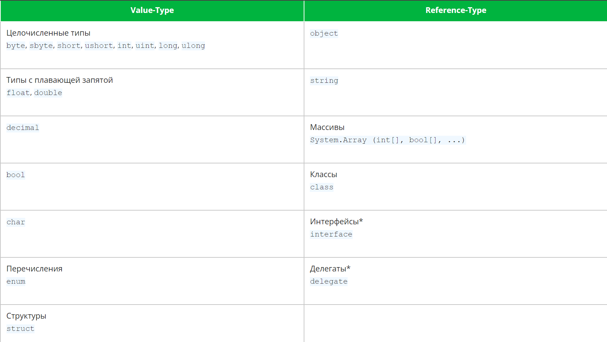

## Char type

`char` is for a single character (string)

## String vs char quotes

Char uses `''`

String uses `""`

## Type conversion

`Convert` class

A variable's type can only be one thing, so you *have to* use a different variable when converting

```cs
string nummy = "5";
int num = Convert.ToInt32(nummy);
```

You can cast values to different values with

```cs
byte byt = (byte) int.Parse(Console.Readline());
```

That even works for stuff like `enum`s and likely classes and stuff

You can use `checked ()` to make sure the type casting doesn't cut the information stored in the variable. 
Will throw an error we can catch if it does.

Instead of `Convert`, you can use `type.Parse` to parse into that type. 
`.TryParse` returns a boolean on whether or not the information was cut

Use `var` for when you don't know the type the variable is going to be / it doesn't matter

It requires you to initialize the variable straight away though

## Type getting

By using the `GetType()` method, you can see what type something is, but it's not as legible as `int` or `string`, it's `System.Int32` and the like

## Random requires an object

```cs
Random random = new Random();
random.Next(); //generate an int
random.NextDouble();
```

With no parameters, generates from 1 to max int

## fstrings in C#

`$"This is text, this is a {variable}"`

## Creating a project

`dotnet new sln -n "name"` create a solution (won't create another folder)

`dotnet new console -n "name"` create a project folder (will create another folder named as the name)

`dotnet new classlib -n "name"` class library

`dotnet sln solutionFile.sln add **/*.csproj` add all the projects below the current folder into the solution

`dotnet add Main/Main.csproj reference Library/Library.csproj` add a reference to the library project to the main project

`dotnet add package PackageName` to add a nuget package

## Escaping special symbols

`\x23` for ascii

`\u1234` for unicode

## Types of numbers and their possible values


Types have two useful properties: `MinValue` and `MaxValue`

So, you can just have the code tell you what you should use, rather than looking it up

## Enums

By default, uses `int`

By default, start a `0` and increment by one

Even if you make the second key equal to 1, for example, that won't change the first one being zero by default

`Weekdays.Monday` would just give its name (as a string)

`(int)Weekdays.Monday` would give us the integer of monday (zero by default)

You can make keys be equal to other keys.
No need to specify the `enum` "class" in that case either

## Byref

`in` keyword

Protects data from being changed, making it readonly

Some things are passed by reference by default (so you don't really need to return them even)

Stuff like `enum`s and arrays

So you could use `void` and return nothing, that will still change what you passed, no need to 

`int[] array = Method(array);`

If you want to introduce this behavior to stuff that gets passed by value, use `ref`

`out` is essentially return. I don't like it but it does exist. Yeah, it is also by reference

## By values vs by reference types



## Properties

```cs
class Human {
   private int age;
   public int Age {
      get {
         return age;
      }
      set {
         age = value;
      }
   }
}
```

The reason for this existing: you can have logic surrounding both actions, that could either do something else required as well, or check the type, or whatever else

If you just just made `age` public and interacted with it directly, you wouldn't be able to program in specific behavior

That said, that can often be unnecessary

## Access modifiers

`sealed` removes the ability to extend (make a child of) the class

`internal` - access to the class only in the same project

`private` - access only within the class

`public` - accessible from anywhere

`protected` - accessible from within the class and all its children

## Polymorphism

`virtual` - this method can be overriden in a child class

`override` - this method overrides this same method in a parent class