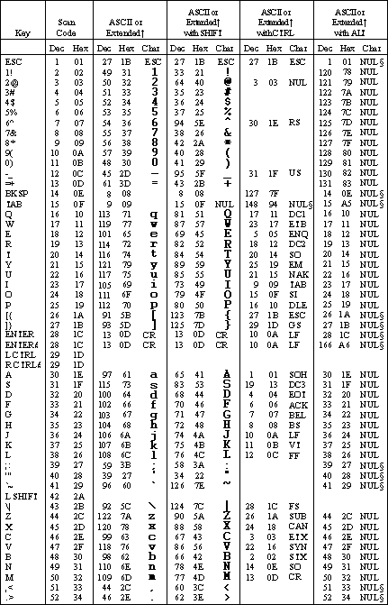
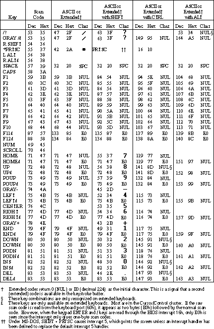

Computer\HKEY_LOCAL_MACHINE\SYSTEM\CurrentControlSet\Control\Keyboard Layout

New binary value: Scancode Map

First line is filled with zeros, until the next line

`02 00 00 00` the header, where 02 means "one remap" 

`1C 00 3A 00` where 1C is enter and 3A is capslock => remapping capslock *to* enter

`00 00 00 00` at the end of the map

