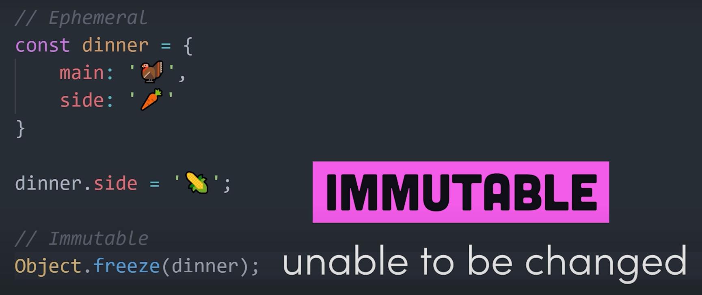

## Variables

`set` -- normal variable

`const` -- variable that can't be changed

> You can make an object const, but still be able to change its properties, just not the object itself

Two steps: declaration and assignment, just like in ahk

`Null` is apparently an object lmao

`Undefined` is `Unset` (kinda)

```javascript
let vari = 1;
vari = toString(vari);
console.log(typeof vari);
```

`toString` is a method, but can be used as a function

`typeof` is a keyword, rather than being a separate function or method

Since `var` is a keyword for making variables, you can't make `var` a random variable name

`, ` for concat that takes care of the spaces

`+` for your usual concat

`true` (and probably `false`) _have to_ be lowercase to be recognized

`name` as a variable name is not supported

The script tag has to be in the body, along with all the other elements

the id you set for a paragraph has to be **in** the tag `<p id="p1"></p>`

That's how you change the value of an html element: `document.getElementById(id).innerHTML`

## Arithmetic expressions

`+= -= *= /= **= %=` are supported, it at least seems like every shortcut operator is

`**` has precedence over `*` and `/`, so it's going to happen before them in an expression

## User input

`window.prompt` -- same as the window that appears to tell you "are you sure you want to exit, but you get to input something

`<br>` for line break in html

`<input>` is a self closing tag, so no need for `</input>` or the like

you have to specify the type of the input it's going to be. for example: "text"

`<button>` type: "button"

You can define functions anywhere, as if it's an expression, there's no limit with braces either

You can grab an html element by id and then have an `OnEvent` for it, `onclick` for example

then you can assign it to a function that fires on the click

onclick is a property though

You can get the value of an inputbox by getting its element, the property of value is the same as ahk: `.value`

```js
let input;
document.getElementById("MyButton").onclick = function () {
	input = document.getElementById("MyText").value;
	document.getElementById("MyLabel").innerHTML = "something changed";
	console.log(input);
};
```

you can even change something on the event! unsuprisingly, but it's fun to comprehend

it's all like ahk!!!

## Type conversion

```js
nummy = Number(stringy);
stringy = String(nummy);
```

`""` and `0` are false, anything else is true (almost)

## Math methods

`Math` -- implicitly imported module, with methods and constants

```js
Math.round(); //Makes the int round (⚾)
Math.trunc(); //Removes any fractional digits (after .) (float => int essentially)
Math.floor();
Math.ceil();
Math.sqrt();
Math.abs();
```

```js
x = 2 ** 2;
y = Math.pow(2, 2);

console.log(x); //4
console.log(y); //4
```

According to the docs, these are _the same_

```js
x = 2 ** 2;
console.log(x);
```

I'm sure there's a reason to have let, but apparently you can straight up just skip the let in declaration, interesting

```js
let x = 2;
let y = 3;
let z = 4;

let m = [2, 3, 4];

max = Math.max(m); //NaN -- it's probably something else for arrays
min = Math.min(x, y, z);

console.log(min, max);
```

You actually have to specify the values one by one, instead of an array

```js
const X = Math.PI;
console.log(X); //3.141592653589793
```

## Hypotenuse

```js
let a = window.prompt();
let b = window.prompt();

let c = Math.sqrt(a ** 2 + b ** 2);
console.log(c);
```

```js
document.getElementById("getSideC").onclick = function () {
	let inputA = document.getElementById("SideAInput").value;
	let inputB = document.getElementById("SideBInput").value;
	console.log(inputA, inputB);
	inputA = Number(inputA);
	inputB = Number(inputB);
	console.log(inputA, inputB);
	document.getElementById("SideC").innerHTML = Math.sqrt(
		inputA ** 2 + inputB ** 2
	);
};
```

Remember to get the value of the inputbox, and not the label!

## Counter

```css
#number {
	display: block;
	text-align: center;
	font-size: 50px;
}
```

## Random number generator

```js
Math.random();
```

Generates a random float from 0 to 1

You can do math on the random method to give you a number that you like more

For example, multiple it by six and ceil it, giving you a random number from 1 to 6

## Timeout, interval

```js
setTimeout();
clearTimeout();
setInterval();
clearInterval();
```

## String methods

Turns out variables can act as objects, so you can use methods on them.

Primitives too! So something like

```js
"string".length;
```

will output 6 just like expected.

There are object properties and variable properties, they seem to be separated at least somewhat

```js
varr.charAt(index);
varr.indexOf(char); //returns the first occurence of the character
varr.lastIndexOf(char); //returns the *last* occurence of the character
varr.trim(); //whitespace from both sides
varr.toUpperCase();
varr.toLowerCase();
```

```js
varr = varr.replaceAll(toReplace, replaceWith);
```

StrReplace

```js
console.log("something".replaceAll("s")); //undefinedomething
```

In ahk you can omit replaceWith, if you don't in js, you'll get undefined

## String clicing

```js
varr1 = varr.slice(startIndex, endIndex);
```

startIndex includes itself

endIndex is exclusionary: up to this index, but not this index itself

## If statements

in js, you're actually required to have () after an if for the expression

## Switch case

```js
const foo = 5;
switch (foo) {
	case 2:
		console.log(2);
		break; // it encounters this break so will not continue into "default:"
	default:
		console.log("default");
	// no break, so it will continue to case 1
	case 1:
		console.log("1");
}
```

### Differences between ahk and js:

-  If you don't have a break, all the following cases will be executed, until met with a break in one of them or it executes all of them
-  Default can be anywhere just like in ahk, but according to 1. it can be used to execute some other cases too, if it doesn't have a break
-  You can either use the case 1, 2, 3 syntax, or have multiple cases with no breaks that all lead to a case that does have a break

---

```js
const foo = 1;
let output = "Output: ";
switch (foo) {
	case 0:
		output += "So ";
	case 1:
		output += "What ";
		output += "Is ";
	case 2:
		output += "Your ";
	case 3:
		output += "Name";
	case 4:
		output += "?";
		console.log(output);
		break;
	case 5:
		output += "!";
		console.log(output);
		break;
	default:
		console.log("Please pick a number from 0 to 5!");
}
```


```js
const action = "say_hello";
switch (action) {
	case "say_hello":
		let message = "hello";
		console.log(message);
		break;
	case "say_hi":
		let message = "hi";
		console.log(message);
		break;
	default:
		console.log("Empty action received.");
}
```

You'll actually get an error, because all the cases are still in the same scope

But if you surround each case with brackets:

```js
const action = "say_hello";
switch (action) {
	case "say_hello": {
		let message = "hello";
		console.log(message);
		break;
	}
	case "say_hi": {
		let message = "hi";
		console.log(message);
		break;
	}
	default:
		console.log("Empty action received.");
}
```

It's gonna be all fine, because now they are separated into different scopes

So apparently you can define the scope yourself with brackets? I wonder how often is this behavior

### Let vs var

`var` is function scope, if it's global, it gets appended to the window object

`let` is {} scope and will _not_ be accessible outside of them

Will also _not_ be appended to the window object

## Checkbox

To make a checkbox, you make an input tag and specify its type with "checkbox"

To make a label specifically _for_ the checkbox, you specify that with a `for` keyword, in which you put the id

## Switch

You actually _can_ just evaluate conditions, but since you still have to give an expression to compare to in a switch, you can just pass `true`

## While loops

Undefined values are false

In a window prompt, if you hit cancel, the value you were supposed to give is `null`, not `false`

## Do While loops

A normal while loop first checks the condition, then does the code

If the condition is first false then true, the whole while loop will be skipped

That's what do while loops are for

First do this, if the condition is true, repeat

## For loops

1. Declare and assign a variable of the for loop
2. While this expression is true, continue
3. Change the variable like this:

```js
let i;
for (i = 1; i <= 10; i++) {
	console.log(i);
}
```

If you want to use the counter variable outside of the for loop, for example, you can declare it outside and just assign it inside

## Functions

Non {}'ed let variables are superglobal

## Variable embeds

`${variable}`

`${}` is considered brackets

Whitespace LITERALLY doesn't matter, you can do this easily:

```js
let text = `Hello, ${userName}
You are ${age} years old
I hope you have a good day!`;
```

the above text won't actually be seen as multiline, if you want linebreaks for html, you need to use `<br>`

On the other hand, the linebreaks are recognized themselves when you use this for console.log

## toLocaleString

```js
number.toLocaleString(locale, { options });
```

```js
1234.56789 => "en-US" => 1,234.568 //a comma for every 000
123456.789 => "hi-IN" => 1,23,456.789 //hindi
123456.789 => "de-DE" => 123.456,789 //german
```

```js
nummie = nummie.toLocaleString("en_US", { style: "currency", currency: "USD" });
```

You can style currency to whatever it is

```js
nummie.toLocaleString(undefined, {style: "percent"})
100 => {style: "percent"} => 10000%
1 => {style: "percent"} => 100%
.5 => {style: "percent"} => 50%
```

```js
{style: "unit", unit: "celcius"}
```

There are a few units you can choose from, such as temperature, weight, distance, etc

## Immutable objects



## Better console.log readability

`console.log(var1, var2)` => `console.log({var1, var2})` for better visibility

`console.table([var1, var2])` is even better

`console.dir(obj)` clean object dropdown

## Everything about console

`console.log(console)`

## Counting in a console log

`console.count("label")` increments the number every time it is called

## Console log timer

`console.time()` starts the timer

`console.timeLog()` outputs the amount of time that has passed since `console.time()`

## Seeing the call stack

`console.trace("message")` shows the call stack

## CSS in your console.log

`console.log("%c the actual message", "CSS")` note the %c