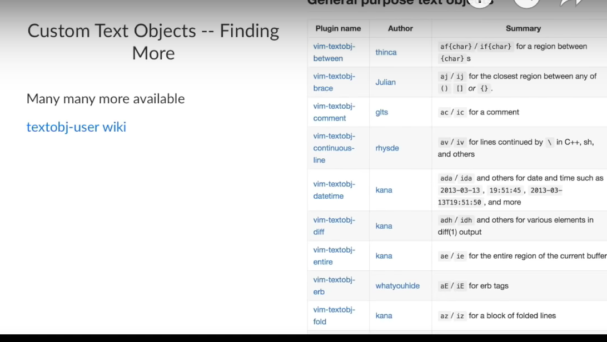

### Neovim

[repository](https://github.com/vscode-neovim/vscode-neovim)

[vscode interaction](https://github.com/vscode-neovim/vscode-neovim#invoking-vscode-actions-from-neovim)

[using lua for init.lua](https://github.com/nanotee/nvim-lua-guide)

### Easy align

[repository](https://github.com/junegunn/vim-easy-align)

### Surround

[repo](https://github.com/tpope/vim-surround)

### Nightfox theme

[repo](https://github.com/EdenEast/nightfox.nvim)

### Everforest theme

[repo](https://github.com/sainnhe/everforest)

### Vim Polyglot

[repo](https://github.com/sheerun/vim-polyglot)

### Repeat

[tpope/vim-repeat](https://github.com/tpope/vim-repeat)

### Git gud at vim

[vim get good](https://github.com/ThePrimeagen/vim-be-good)

### Easymotion (vim)

[repo](https://github.com/easymotion/vim-easymotion)

### CamelCaseMotion

[repo](https://github.com/bkad/CamelCaseMotion)

### Text Objects

### Marks

[repo](https://github.com/chentoast/marks.nvim)
